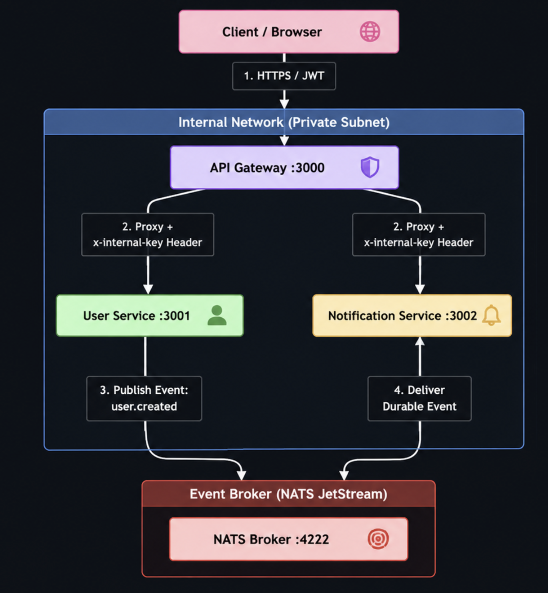

# Distributed Microservices System — User, Notification & API Gateway

A secure, reliable, and production-ready microservices architecture showcasing asynchronous inter-service communication via **NATS JetStream**, a centralized **API Gateway**, JWT authentication, rate limiting, and zero-trust downstream verification.

---


## 1. Architecture Diagram




### Components:
- **API Gateway (Port 3000):** Acts as the single entry point. Responsibilities include CORS management, security header injection via `helmet`, IP rate limiting, JWT token validation, and proxy routing to downstream services.
- **User Service (Port 3001):** Manages user resources in-memory. When a user is successfully created, it publishes a `user.created` event to NATS.
- **Notification Service (Port 3002):** Subscribes to the NATS JetStream server. When a `user.created` event is received, it asynchronously logs the event and stores a welcome notification in its database.
- **NATS JetStream (Port 4222):** The asynchronous messaging broker configured with durable stream properties for guaranteed at-least-once delivery.

---

## 2. Key Architecture & Security Decisions

### Zero-Trust Internal Networking
Downstream microservices (User and Notification) should not be exposed to the internet. However, in standard environments, they verify the validity of requests using a shared **Internal API Key** passed in the `x-internal-key` header. Any direct request bypassing the gateway is rejected with a `403 Forbidden`.

### Reliable Asynchronous Events
We use **NATS JetStream** with a **durable consumer** (`notification-service`). 
- **At-Least-Once Delivery:** NATS ensures that the Notification Service must explicitly acknowledge (`ack()`) the message.
- **Auto-Retry & Replay:** If the Notification Service crashes or fails to process a message, it sends a negative acknowledgment (`nak(delay)`), causing NATS to retry delivery after a cooldown period. If the service is offline when a user is created, NATS retains the message and replays it as soon as the service reconnects.

### High Testability
The Express application configurations have been refactored and separated from the socket listeners (`app.listen()`). This allows unit and integration tests to run with **ephemeral ports** in parallel, eliminating port conflicts and allowing developers to fully mock network transport (like NATS) for deterministic and lightning-fast test execution.

---

## 3. Getting Started

### Option A: Running with Docker Compose (Recommended)

#### Prerequisites:
- [Docker](https://docs.docker.com/get-docker/) & Docker Compose

#### Steps:
1. **Start all services:**
   ```bash
   docker compose up --build -d
   ```
2. **View runtime logs:**
   ```bash
   docker compose logs -f
   ```
3. **Stop all services and clean volumes:**
   ```bash
   docker compose down -v
   ```

---

### Option B: Running Locally (Natively on Host)

#### Prerequisites:
- **Node.js** (v20.6.0+ is recommended for native `.env` loading)
- **NATS Server** (e.g. `brew install nats-server` on macOS)

#### Steps:
1. **Start NATS Server with JetStream enabled:**
   ```bash
   nats-server -js
   ```
2. **Install all service dependencies:**
   ```bash
   npm --prefix gateway install && npm --prefix user-service install && npm --prefix notification-service install
   ```
3. **Configure Environment Variables:**
   A local [.env](.env) file is available in the root. Verify it has the following keys:
   ```env
   JWT_SECRET=dev-jwt-secret-do-not-use-in-production
   INTERNAL_API_KEY=dev-internal-key-do-not-use-in-production
   USER_SERVICE_URL=http://localhost:3001
   NOTIFICATION_SERVICE_URL=http://localhost:3002
   ```
4. **Run the services:**
   Open three separate terminals and run:
   ```bash
   # Terminal 1: Gateway
   node --env-file=.env --watch gateway/src/index.js

   # Terminal 2: User Service
   node --env-file=.env --watch user-service/src/index.js

   # Terminal 3: Notification Service
   node --env-file=.env --watch notification-service/src/index.js
   ```

---

## 4. Running the Automated Test Suite

We use **Jest** and **Supertest** to run in-memory integration tests. These mock the NATS client to run isolated, deterministic, and fast tests without requiring an active NATS server.

```bash
# Run tests for Gateway
cd gateway && npm install && npm run test

# Run tests for User Service
cd ../user-service && npm install && npm run test

# Run tests for Notification Service
cd ../notification-service && npm install && npm run test
```

---

## 5. API Documentation

### Public Endpoints

#### `GET /health`
Verifies Gateway health.
- **Response (200 OK):**
  ```json
  { "status": "ok", "service": "gateway" }
  ```

#### `POST /auth/login`
Authenticates a user and issues a short-lived JWT.
- **Request Body:**
  ```json
  {
    "username": "admin",
    "password": "admin123"
  }
  ```
- **Response (200 OK):**
  ```json
  {
    "token": "eyJhbGciOiJIUzI1NiIsInR5cCI6IkpXVCJ9..."
  }
  ```
- **Response (401 Unauthorized):**
  ```json
  { "error": "Invalid credentials" }
  ```

---

### Protected Endpoints (Requires `Authorization: Bearer <token>`)

#### `POST /api/users`
Creates a new user and triggers a NATS event.
- **Request Body:**
  ```json
  {
    "name": "Jane Doe",
    "email": "jane@example.com"
  }
  ```
- **Response (201 Created):**
  ```json
  {
    "id": "24c565e3-abd0-4b3a-97a4-e9f9f66fa0ed",
    "name": "Jane Doe",
    "email": "jane@example.com",
    "createdAt": "2026-08-12T14:36:42.694Z"
  }
  ```
- **Response (400 Bad Request - Validation Failed):**
  ```json
  {
    "error": "Validation failed",
    "details": ["\"email\" must be a valid email"]
  }
  ```
- **Response (409 Conflict - Duplicate Email):**
  ```json
  { "error": "Email already exists" }
  ```

#### `GET /api/users`
Retrieves a list of all created users.
- **Response (200 OK):**
  ```json
  [
    {
      "id": "24c565e3-abd0-4b3a-97a4-e9f9f66fa0ed",
      "name": "Jane Doe",
      "email": "jane@example.com",
      "createdAt": "2026-08-12T14:36:42.694Z"
    }
  ]
  ```

#### `GET /api/users/:id`
Retrieves a single user by their UUID.
- **Response (200 OK):**
  ```json
  {
    "id": "24c565e3-abd0-4b3a-97a4-e9f9f66fa0ed",
    "name": "Jane Doe",
    "email": "jane@example.com",
    "createdAt": "2026-08-12T14:36:42.694Z"
  }
  ```
- **Response (404 Not Found):**
  ```json
  { "error": "User not found" }
  ```

#### `GET /api/notifications`
Retrieves all welcome notifications processed asynchronously via the event broker.
- **Response (200 OK):**
  ```json
  [
    {
      "id": "7fff3b0f-cbcd-4e05-9f2d-2e43b195c8e1",
      "type": "WELCOME",
      "userId": "24c565e3-abd0-4b3a-97a4-e9f9f66fa0ed",
      "message": "Welcome, Jane Doe! Your account (jane@example.com) has been created.",
      "createdAt": "2026-08-12T14:36:42.695Z"
    }
  ]
  ```

---

## 6. Project Structure

```
trams/
├── docker-compose.yml
├── .env / .env.example
├── README.md
├── gateway/
│   ├── Dockerfile
│   ├── package.json
│   └── src/
│       ├── index.js          # Startup listener
│       ├── app.js            # Express app logic & routes
│       └── gateway.test.js   # Gateway integration tests
├── user-service/
│   ├── Dockerfile
│   ├── package.json
│   └── src/
│       ├── index.js          # Startup listener
│       ├── app.js            # Express app logic & routes
│       ├── nats.js           # NATS client initialization
│       ├── user.test.js      # User Service integration tests
│       ├── middleware/
│       │   └── auth.js       # Internal key validation middleware
│       ├── routes/
│       │   └── user.routes.js
│       ├── controllers/
│       │   └── user.controller.js
│       └── services/
│           └── user.service.js
└── notification-service/
    ├── Dockerfile
    ├── package.json
    └── src/
        ├── index.js          # Startup listener
        ├── app.js            # Express app logic & routes
        ├── nats.js           # NATS subscription helper
        ├── notification.test.js # Notification Service integration tests
        ├── middleware/
        │   └── auth.js       # Internal key validation middleware
        ├── routes/
        │   └── notification.routes.js
        ├── controllers/
        │   └── notification.controller.js
        └── services/
            └── notification.service.js
```
